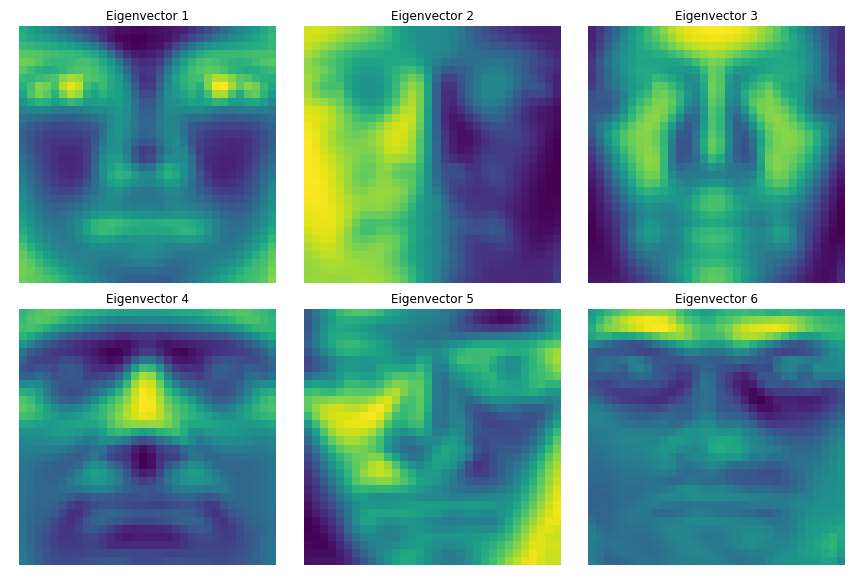

# Homework 2 Report - SVD on Yale Faces Data

**Author**:

Ewan Lister

**Abstract**:

In this assignment, we utilize correlation matrices, single value decomposition (SVD), and eigendecomposition to analyze the facial data contained within the Extended Yale B dataset. Using the aforementioned techniques, we seek to isolate base features which compose all human faces, and to estimate the similarities and differences betweeen faces. We will discuss the mathematical theory of the techniques, their application, and evaluate the results. By applying SVD to an easy to visualize data set, we can prepare our understanding, and generalize the technique for higher dimensions in future work.

## I. Introduction and Overview
Linear algebra is the mathematical framework by which we manipulate numerical and analyze numerical data. It is not just some tool for multiplying numbers easily. It aligns the data in such a way that one can quickly identify underlying relationships. 

In this assignment we begin by constructing a correlation matrix of the first 100 images in the `yalefaces.mat`, which provides us with a rough understanding of the similarity of each facial image relative to every other in the set of 100. Within this correlation matrix we identify the most similar and least similar images, based on the maximum magnitude and minimum magnitude entries found within the correlation matrix. We then construct an even smaller matrix taken from 10 images, to get a better understanding of its visual interpretation.

We follow by performing an eigendecomposition on a full correlation matrix $Y$ of all images found in `yalefaces.mat`. Because the eigenvectors and eigenvalues can be used to reconstruct their respective matrix, the example demonstrates that the yale faces are essentially composed linear combinations of so called base faces, or **eigenfaces**.

We conclude the algorithm implementation by executing an SVD on the matrix $Y$, an algorithm which is slightly similar, but more robust then eigendecomposition. Comparing the results we can see some of the similarities and differences between the two.

In the following sections, we plot and interpret our results, 

## Theoretical Background

In this section we will present mathematical theory covering the topics of correlation, eigenpairs, and singular value decomposition. Knowing the basic principles of these techniques will help us to investigate the facial image data.

### Correlation

In a statistical sense, correlation is a measurement of how closely related two variables are. In linear algebra we can express correlation between two vector as their dot product. Thus the correlation between two vectors $x_a$ and $x_b$ would be expressed as:

$$\rho_{ab} = x_a * x_b$$

If we wished to analyze the correlation in a matrix between each vector and every other, we can take the dot product for combination of vectors, and map that point to the column and row coordinated of the multiplied vectors, thus creating a **correlation matrix**.

### Eigenpairs

Many types of data can be processed so that underlying vectors which better describe the behavior of the data become visible. To illustrate, for square matrices, the transformation that the matrix achieves can be expressed by scalars called **eigenvalues** multiplying vectors called **eigenvectors**. If a given matrix $A$ operating on a vector $v$ causes $v$ to be scaled by some constant $\lambda$, then $v$ is an eigenvector of $A$ and $\lambda$ is the corresponsing eigenvalue, such that they form an **eigenpair**. All eigenpairs of $A$ satisfy the following equation:

$$ Av = \lambda v$$

### SVD

Singular Value Decomposition or SVD is a ubiquitous technique in data analysis that allows dimensional data to be decomposed into so called modes and singular values. Much like eigenvectors, modes provide a better description of what matrix data is actually composed of. SVD consists of decomposing a matrix $A$ in the following fashion:

$$ A = U\Sigma V^{T}$$

Where A can be any matrix of size $m \times n$, U is assumed to be unitary, S is a diagonal matrix with positive entries, and V is unitary. Thus the matrix is represented as a linear combination of basis vectors operating on a unitary matrix V.

In the following section we will explore the use of these techniques on the `yalefaces.mat` data.

## Algorithm Implementation and Development

import statements and loading data

    # import numpy, scipy, and yale faces data
    import numpy as np
    from scipy.io import loadmat
    import matplotlib.pyplot as plt
    results=loadmat('yalefaces.mat')
    X=results['X'] 

### (a) Compute a 100 × 100 correlation matrix $C$ where you will compute the dot product (correlation) between the first 100 images in the matrix $X$.

isolate first 100 vectors in matrix and compute dot product

    first_100_images = X[:, :100]

    correlation_matrix = np.dot(first_100_images.T, first_100_images)

plot correlation matrix

    # Plot the correlation matrix
plt.figure(figsize=(10, 10))
plt.imshow(correlation_matrix, cmap='viridis')
plt.colorbar()

    # Set the title and axes labels
    plt.title('Correlation Matrix of the First 100 Images')
    plt.xlabel('Image Index')
    plt.ylabel('Image Index')

    # Adjust the axes range and ticks
    plt.xlim(-0.5, 99.5)
    plt.ylim(99.5, -0.5)
    plt.xticks(np.arange(0, 100, 10))
    plt.yticks(np.arange(0, 100, 10))

    # Show the plot
    plt.show()

### (b) From the correlation matrix for part (a), which two images are most highly correlated? Which are most uncorrelated? Plot these faces.

mask matrix data so that identical but low correlation value images are not used

    masked_corr_matrix = np.ma.array(correlation_matrix, mask=np.eye(correlation_matrix.shape[0], dtype=bool))

identify min and max correlation images and extract

    max_corr_indices = np.unravel_index(np.ma.argmax(masked_corr_matrix), masked_corr_matrix.shape)
    min_corr_indices = np.unravel_index(np.ma.argmin(masked_corr_matrix), masked_corr_matrix.shape)

    highest_corr_images = first_100_images[:, max_corr_indices]
    lowest_corr_images = first_100_images[:, min_corr_indices]

plot images 

    fig, axs = plt.subplots(2, 2, figsize=(10, 10))

    # Plot the images with highest correlation
    axs[0, 0].imshow(highest_corr_images[:, 0].reshape(32, 32), cmap='viridis')
    axs[0, 0].set_title('Image {} (High Correlation)'.format(max_corr_indices[0]))
    axs[0, 0].axis('off')

    axs[0, 1].imshow(highest_corr_images[:, 1].reshape(32, 32), cmap='viridis')
    axs[0, 1].set_title('Image {} (High Correlation)'.format(max_corr_indices[1]))
    axs[0, 1].axis('off')

    # Plot the images with lowest correlation
    axs[1, 0].imshow(lowest_corr_images[:, 0].reshape(32, 32), cmap='viridis')
    axs[1, 0].set_title('Image {} (Low Correlation)'.format(min_corr_indices[0]))
    axs[1, 0].axis('off')

    axs[1, 1].imshow(lowest_corr_images[:, 1].reshape(32, 32), cmap='viridis')
    axs[1, 1].set_title('Image {} (Low Correlation)'.format(min_corr_indices[1]))
    axs[1, 1].axis('off')

    plt.tight_layout()
    plt.show()

Title/author/abstract Title, author/address lines, and short (100 words or less) abstract. 
Sec. I. Introduction and Overview
Sec. II. Theoretical Background
Sec. III. Algorithm Implementation and Development 
Sec. IV. Computational Results
Sec. V. Summary and Conclusions

