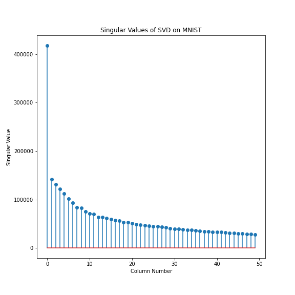
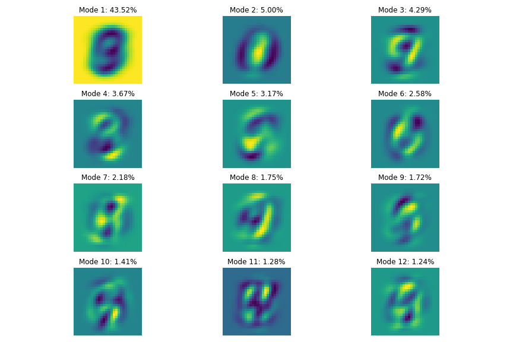
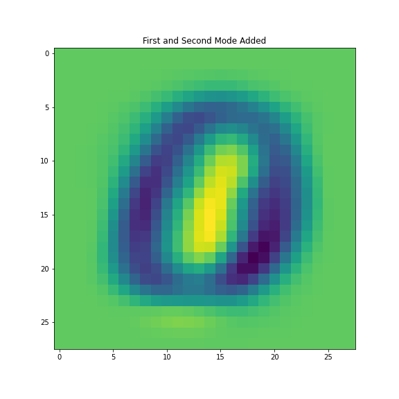
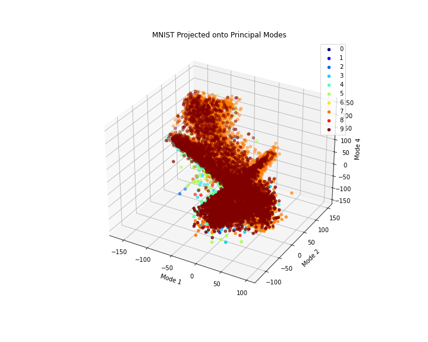
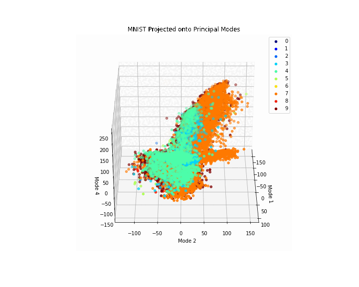
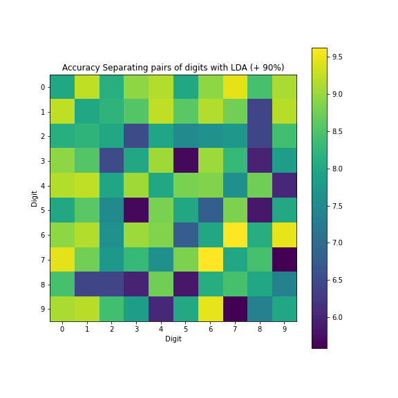

# Homework 3 Report - Comparing Linear Classifiers on MNIST Data Set

**Author**:

Ewan Lister

**Abstract**:

In this assignment, we conduct an analysis of the MNIST dataset, a collection of handwritten digits used for machine learning research. The analysis begins with an SVD analysis of the digit images, exploring the singular value spectrum and determining the rank necessary for good image reconstruction. The interpretation of the U, $\Sigma$, and V matrices is also discussed. The report then builds a classifier to identify individual digits in the training set, using LDA to classify two and three selected digits. The difficulty of separating different pairs of digits is quantified using LDA, SVM, and decision tree classifiers, with performance compared on both training and test sets. The report includes multiple visualizations to aid in understanding the results.

## Introduction and Overview

In this report, we present an analysis of the MNIST dataset, which contains handwritten digits that have been used extensively for machine learning research. We begin by discussing the theoretical background, including the concepts of SVD analysis, PCA space, and linear classifiers such as LDA and SVM. We then describe the algorithm implementation and development process, including reshaping the digit images into column vectors, performing SVD analysis, and building classifiers to identify individual digits.

Next, we present the computational results of our analysis, including the singular value spectrum and the number of modes necessary for good image reconstruction. We also discuss the accuracy of our classifiers on the training and test sets, as well as the difficulty of separating different pairs of digits. We compare the performance of LDA, SVM, and decision tree classifiers on the hardest and easiest pairs of digits to separate.

Finally, we provide a summary and conclusions, discussing the key findings of our analysis and the implications for future research. Throughout the report, we include visualizations to aid in understanding the results. Overall, our analysis demonstrates the power of SVD analysis and linear classifiers for identifying handwritten digits and highlights the challenges involved in separating certain pairs of digits.

## Theoretical Background

In this section we will present mathematical theory covering the topics of classifiers, such as the SVM, LDA, and DTC methods.

### Support Vector Machines (SVM)

Support Vector Machines (SVM) are a popular class of binary classifiers used in machine learning. The goal of SVM is to find a hyperplane that maximally separates two classes of data points. This hyperplane is chosen to maximize the margin between the two classes of points.

The SVM optimization problem can be written as follows:

$$min_{w,b,\\xi} \\frac{1}{2} \\lVert w \\rVert^2 + C\\sum_{i=1}^{n} \\xi_i$$

subject to the constraints:

$$y_i(w^Tx_i+b) \\geq 1 - \\xi_i$$

$$\\xi_i \\geq 0$$

where $w$ is the weight vector, $b$ is the bias term, $\xi_i$ is the slack variable, and $C$ is a hyperparameter that controls the trade-off between maximizing the margin and minimizing the classification error. The first constraint ensures that each data point is on the correct side of the hyperplane, while the second constraint ensures that the margin is not too wide.

### Linear Discriminant Analysis (LDA)
Linear Discriminant Analysis (LDA) is a popular method for dimensionality reduction and classification. The goal of LDA is to find a linear transformation of the data that maximizes the separation between two classes.

The LDA optimization problem can be written as follows:

$$max_{w} \\frac{w^TS_bw}{w^TS_ww}$$

where $S_b$ is the between-class scatter matrix and $S_w$ is the within-class scatter matrix. The between-class scatter matrix measures the distance between the class means, while the within-class scatter matrix measures the variability within each class.

The optimal weight vector $w$ is then used to project the data onto a lower-dimensional subspace, which can be used for classification.

### Decision Trees

Decision trees are a popular class of classifiers that use a tree structure to recursively partition the feature space. The goal of a decision tree is to find the optimal set of binary splits that minimize the classification error.

The decision tree optimization problem can be written as follows:

$$min_{\\Theta} \\sum_{i=1}^{n} I(y_i \\neq f(x_i; \\Theta))$$

where $\Theta$ is the set of binary splits, $f(x_i; \Theta)$ is the decision tree classifier, and $I(y_i \neq f(x_i; \Theta))$ is the classification error. The optimal set of binary splits can be found using various algorithms, such as greedy search or dynamic programming.

Overall, SVM, LDA, and decision trees are all popular and effective methods for classification in machine learning. Each method has its own strengths and weaknesses, and the choice of method often depends on the specific problem and the characteristics of the data.

## Algorithm Implementation and Development

import libraries and load mnist data

    import numpy as np
    from sklearn.datasets import fetch_openml
    from sklearn.decomposition import PCA
    import matplotlib.pyplot as plt
    from sklearn.tree import DecisionTreeClassifier
    from sklearn.svm import SVC
    from sklearn.model_selection import train_test_split
    from sklearn.discriminant_analysis import LinearDiscriminantAnalysis
    from sklearn.metrics import accuracy_score

    # fetch MNIST dataset
    mnist = fetch_openml('mnist_784', version=1)

    # Convert the data and labels into numpy arrays
    data = np.array(mnist['data'])
    labels = np.array(mnist['target'])

    # take transpose of data to convert to short-wide matrix
    data = data.T

### 1. Do an SVD analysis of the digit images. You will need to reshape each image into a column vector and each column of your data matrix is a different image.

call numpy linear algebra SVD method, execute

    U, S, Vt = np.linalg.svd(data, full_matrices=False)

### 2. What does the singular value spectrum look like and how many modes are necessary for good image reconstruction? (i.e. what is the rank rof the digit space?)

plot and print first 50 SV

    # initialize white facecolor for plots
    w = 'white'

    # print first 50 singular values
    print(S[0:50])

    # Plot singular values
    plt.figure(figsize=(8, 8))
    plt.stem(np.arange(0, 50), S[0:50])

    # Set the title and axes labels
    plt.title('Singular Values of SVD on MNIST')
    plt.xlabel('Column Number')
    plt.ylabel('Singular Value')

    # Show the plot
    plt.savefig('./Figures/first_50_singular_values.png', facecolor=w)
    plt.show()

compute total variance captured by all modes

    # Compute the total variance captured by all modes
    total_variance_captured = np.sum(S ** 2)

    # Compute the variance captured by each mode
    variance_captured = (S ** 2) / total_variance_captured

    # Convert the variance captured to percentage
    percentage_variance_captured = variance_captured * 100

Plot first 12 modes

    # Print the percentage of the variance captured by each mode
    for i in range(6):
        print("Percentage of the variance captured by Mode {}: {:.2f}%".format(i+1, percentage_variance_captured[i]))

    # Plot the first six modes as images
    fig, axs = plt.subplots(4, 3, figsize=(12, 8))

    for i in range(12):
        row = i // 3
        col = i % 3
        axs[row, col].imshow(U[:, i].reshape(28, 28), cmap='viridis')
        axs[row, col].set_title('Mode {}: {:.2f}%'.format(i+1, percentage_variance_captured[i]))
        axs[row, col].axis('off')

    plt.tight_layout()
    plt.savefig('./Figures/first_6_modes.jpg', facecolor=w)
    plt.show()

### 4. On a 3D plot, project onto three selected V-modes (columns) colored by their digit label. For example, columns 2,3, and 5.

isolate modes 2, 3, and 5 of $V$, project MNIST onto modes

    modes = [1, 2, 4]
    V = Vt.T
    V_modes = V[modes, :]
    proj_data = np.dot(mnist.data, V_modes.T)

plot graph

    fig = plt.figure(figsize=(10, 8))
    ax = fig.add_subplot(111, projection='3d')
    targets = np.unique(mnist.target.astype(np.int))
    colors = plt.cm.jet(np.linspace(0, 1, len(targets)))
    for target, color in zip(targets, colors):
        idx = np.where(mnist.target.astype(np.int) == target)
        ax.scatter(proj_data[idx, 0], proj_data[idx, 1], proj_data[idx, 2], c=color, label=target)
    ax.set_xlabel('Mode ' + str(modes[0]))
    ax.set_ylabel('Mode ' + str(modes[1]))
    ax.set_zlabel('Mode ' + str(modes[2]))
    ax.legend()
    plt.title('MNIST Projected onto Principal Modes')
    plt.savefig('./Figures/proj_3_modes_all.png', facecolor=w)
    plt.show()

### 5. Pick two digits. See if you can build a linear classifier (LDA) that can reasonable identify/classify them.

extract data and labels

    X = np.array(mnist['data'])
    X = X.T
    y = np.array(mnist['target'])

pick two digits (1 and 2)

    dig1 = '1'
    dig2 = '2'

create masks on dataset which select only data with specified digits, define a dictionary for digit pairs

    mask1 = y == dig1
    mask2 = y == dig2
    data_dict = {}

concatenate data and labels

    X_1 = X[:, mask1]
    X_2 = X[:, mask2]
    y_1 = np.zeros(len(X_1[0]))
    y_2 = np.ones(len(X_2[0]))

    X_dig = np.concatenate((X_1, X_2), axis=1)
    X_dig = X_dig.T
    y_dig = np.concatenate((y_1, y_2))

separate training and test data, organize

    X_train, X_test, y_train, y_test = train_test_split(X_dig, y_dig, test_size=0.3, random_state=42)
    data_dict[('1','2')] = (X_train, y_train, X_test, y_test)

    one_two = ('1', '2')
    X_train = data_dict[one_two][0]
    y_train = data_dict[one_two][1]
    X_test = data_dict[one_two][2]
    y_test = data_dict[one_two][3]

initialise linear discriminant analysis type classifier, train

    lda = LinearDiscriminantAnalysis()
    lda.fit(X_train, y_train)

classify test data, calculate accuracy, and print

    y_pred = lda.predict(X_test)
    acc = accuracy_score(y_test, y_pred)
    print(f"Accuracy for digits {(1, 2)}: {acc:.2f}")

### 7. Which two digits in the data set appear to be the most difficult to separate? Quantify the accuracy of the separation with LDA on the test data. 8. Which two digits in the data set are most easy to separate? Quantify the accuracy of the separation with LDA on the test data.

define function which fits a classifier to training and test data for two given digits, and prints the accuracy

    def fit_and_err(lda, train_set, pair):
        X_train = train_set[0]
        y_train = train_set[1]
        X_test = train_set[2]
        y_test = train_set[3]   
        # Train a linear classifier
        lda.fit(X_train, y_train)
        # Evaluate the performance on the test set
        y_pred = lda.predict(X_test)
        acc = accuracy_score(y_test, y_pred)
        print(f"Accuracy for digits {pair}: {acc:.5f}")
        return acc

ititialize all possible pairs of unique digits (10 choose 2)

    digit_pairs = [(i, j) for i in range(10) for j in range(i + 1, 10)]

loop over pairs of digits, generate mask, apply mask to data,
concatenate, and train-test split

    for digit_pair in digit_pairs:
        dig1 = str(digit_pair[0])
        dig2 = str(digit_pair[1])

        mask1 = y == dig1
        mask2 = y == dig2

        X_1 = X[:, mask1]
        X_2 = X[:, mask2]
        y_1 = np.zeros(len(X_1[0]))
        y_2 = np.ones(len(X_2[0]))

        # Merge the images and labels into a single dataset
        X_dig = np.concatenate((X_1, X_2), axis=1)
        X_dig = X_dig.T
        y_dig = np.concatenate((y_1, y_2))

        X_train, X_test, y_train, y_test = train_test_split(X_dig, y_dig, test_size=0.3, random_state=42)
        data_dict[digit_pair] = (X_train, y_train, X_test, y_test)

initialize accuracy matrix

    acc_for_pairs = np.zeros((10, 10))

loop through digit pairs, acces training and test data, and
call `fit_and_err` function, which prints accuracy

    for pair in digit_pairs:
        train_set = data_dict[pair]
        accuracy = fit_and_err(lda, train_set, pair)
        acc_for_pairs[pair[0]][pair[1]] = accuracy
        acc_for_pairs[pair[1]][pair[0]] = accuracy

format matrix for colormap display, set diagonal to some intermediate value between outliers

    acc_for_pairs1 = (acc_for_pairs * 100) - 90
    np.fill_diagonal(acc_for_pairs1, 8)

plot accuracy matrix

    plt.figure(figsize=(8, 8))
    plt.imshow(acc_for_pairs1, cmap='viridis')
    plt.colorbar()

    plt.title('Accuracy Separating pairs of digits with LDA (+ 90%)')
    plt.xlabel('Digit')
    plt.ylabel('Digit')

    plt.xticks(np.arange(0, 10))
    plt.yticks(np.arange(0, 10))

    plt.savefig('./Figures/acc_lda_mat.png', facecolor=w)
    plt.show()

identify and print arguments for minimum and maximum accuracy values 

    min_idx = np.argmin(acc_for_pairs1)
    max_idx = np.argmax(acc_for_pairs1)
    print(min_idx, max_idx)

### 9. SVM (support vector machines) and decision tree classifiers were the state-of-the-art until about 2014. How well do these separate between all ten digits? (see code below to get started).

separate training and test data for all 10 digits

    X_train, X_test, y_train, y_test = train_test_split(mnist.data, mnist.target, test_size=0.2)

initialize SVM classifier and apply to data

    clf = SVC()
    clf.fit(X_train, y_train)

attempt to classify test data, calculate accuracy, and print

    y_pred = clf.predict(X_test)
    accuracy = accuracy_score(y_test, y_pred)
    print(f"Accuracy: {accuracy}")

### 10. Compare the performance between LDA, SVM and decision trees on the hardest and easiest pair of digits to separate (from above).

reinitialize classifiers

    dtc = DecisionTreeClassifier()
    clf = SVC()
    lda = LinearDiscriminantAnalysis()

identify worst and best digits to separate and training and test data from dictionary

    worst_digs = (7, 9)
    best_digs = (6, 7)
    worst_set = data_dict[worst_digs]
    best_set = data_dict[best_digs]

fit LDA classifier

    lda_worst = fit_and_err(lda, worst_set, worst_digs)
    lda_best = fit_and_err(lda, best_set, best_digs)

fit SVM classifier

    svm_worst = fit_and_err(clf, worst_set, worst_digs)
    svm_best = fit_and_err(clf, best_set, best_digs)

fit DTC classifier

    dtc_worst = fit_and_err(dtc, worst_set, worst_digs)
    dtc_best = fit_and_err(dtc, best_set, best_digs)

## Computational Results and Interpretation

### **Analysis**

### 2. Singular Value Spectrum and Modes

Because the U modes of the MNIST matrix form a basis for the space in which all of the images exist, we can actually begin to construct legible images by simply taking linear combinations of the U modes. After all, an MNIST image is really just a 784 dimension vector. The first mode of U already accounts for about 44% of the variance between vectors, so by adding the first mode to the second mode, we get something that quite closely resembles a well known digit:

The addition or subtraction of other scaled U modes will allow us to perfectly recreate all of the images within the matrix. In theory we need 784 orthogonal modes to span every vector in A, but to the human eye we likely only need 30-40 modes to recreate images that resemble digits. Any subsequent modes are fitted to very slight variations between images.

### 3. What is the interpretation of the U, Σ, and V matrices?

The U, $\Sigma$ and V matrices represent the transformation that the facial images data causes to a vector. 

Let's refer to the facial images data as matrix A. The columns of U form an orthonormal basis for the vector space of A, and capture the directions of maximum variance in the row space of A. In other words, the first column of U is the vector which when reshaped to image size represents the most significant vector in the basis of A, which you would need to reconstruct the majority of images which are columns in A.

The singular values of the diagonal of $\Sigma$ represent the amount of variance captured by each respective vector in U. Consider that taking the dot product of $u_1$ with every column vector in A, and taking the sum of these dot products would be a related value, and $u_2$ would have a smaller value. In fact, in this specific decomposition, the first U mode $u_1$ captures 43.5% of the variance, while all others only capture below 5 percent. This makes sense, given that the data set contains images of integers that are only slightly rotated from vertical, and are typically centered. The rest of the image is white space, and you need only one mode to get almost halfway towards plotting a number.

As for V, V is simply the basis for the row space of A, where each column of V is a vector, and each vector is ranked according to how much variance it's direction captures. SVD forms of A would contain $V^T$, so instead the rows of V are a basis for the row space of A. They are equivalently the modes of V, and are perhaps slightly less intuitive in this example because they do not describe the column vectors, which are the images, but instead the vector constructed from taking one pixel from each image. 

### 4. Projection of images onto three modes

When we project onto modes 2, 3, and 5, we are essentially taking the dot product of one column in A with some label against mode 2, then mode 3, then mode 5. The results of these dot products form a 3d coordinate, we then plot this coordinate and label it according to the digit that described the image. Carry this out for all images in the data, and soon you have a graphical understanding of how all of the points relate to the modes. Notes that the labels on the graph are zero indexed, so Mode 1 on the graph corresponds to mode 2 in reality.

In the plot much of the data falls within similar areas, but some distinct features are also present. Examinine the 3d animation below. In general the cloud of points are contained in a cross formation, where a large cloud consisting mostly 8s, 7s, and 9s extends up into the positive levels of correlation to Mode 5. Looking at the two more linear patches of lines, most of the data is clustered at the intersection of these lines, or on the lines themselves. If we were to curve fit functions to these pairs of lines, then we could begin to identify specific parameters which described how to linearly combine the modes to create an image along that line. 

If this were an unsupervised learning example, PCA would still be very useful for interpreting the data, as distinct spacial patterns are visible to the human eye even without the labeling of points.

### **Building and Comparing Classifiers**

### Results of LDA Classifier on two arbitrary digits

| Classifier  | Digits | Accuracy     |
| ------------|  ---------   |   ---------- |
| LDA      | 1, 2       |  0.98  |

Initially we selected two digits which are easy to separate as a benchmark for the LDA classifier. 1 has almost no correlation with the feature space we would associate with horizontal bars found in most numbers. Consider 7, 5, 9, 8, and 2. All of these numbers have some sort of extended line segment at their top. Thus it's likely trivial for an LDA classifier to separate simple vertical line segment 1s from 2s. In the case where images contained a 1 which contains a small bent serif at the top, this would extend the 1 into the aforementioned feature space, not to mention the large serif at the bottom, which resembles that at the base of a 2.

This is just an example of the similarities and differences between digits that would influence how they are classified, if LDA seeks to reduce the dimensionality of data while still specifying the most significant differences between distinct labels, these similarities can decrease its accuracy.

### Results of LDA Classifier on all 45 digit pairs

| Classifier | Digits | Accuracy |
|------------|--------|----------|
| LDA        | (0,1)  | 99.233%  |
| LDA        | (0,2)  | 98.129%  |
| LDA        | (0,3)  | 98.932%  |
| LDA        | (0,4)  | 99.150%  |
| LDA        | (0,5)  | 97.982%  |
| LDA        | (0,6)  | 98.936%  |
| LDA        | (0,7)  | 99.460%  |
| LDA        | (0,8)  | 98.446%  |
| LDA        | (0,9)  | 99.110%  |
| LDA        | (1,2)  | 98.207%  |
| LDA        | (1,3)  | 98.535%  |
| LDA        | (1,4)  | 99.229%  |
| LDA        | (1,5)  | 98.591%  |
| LDA        | (1,6)  | 99.164%  |
| LDA        | (1,7)  | 98.770%  |
| LDA        | (1,8)  | 96.418%  |
| LDA        | (1,9)  | 99.191%  |
| LDA        | (2,3)  | 96.509%  |
| LDA        | (2,4)  | 97.949%  |
| LDA        | (2,5)  | 97.494%  |
| LDA        | (2,6)  | 97.620%  |
| LDA        | (2,7)  | 97.736%  |
| LDA        | (2,8)  | 96.429%  |
| LDA        | (2,9)  | 98.399%  |
| LDA        | (3,4)  | 99.045%  |
| LDA        | (3,5)  | 95.665%  |
| LDA        | (3,6)  | 99.025%  |
| LDA        | (3,7)  | 98.291%  |
| LDA        | (3,8)  | 95.990%  |
| LDA        | (3,9)  | 97.825%  |
| LDA        | (4,5)  | 98.808%  |
| LDA        | (4,6)  | 98.856%  |
| LDA        | (4,7)  | 97.616%  |
| LDA        | (4,8)  | 98.755%  |
| LDA        | (4,9)  | 96.034%  |
| LDA        | (5,6)  | 96.790%  |
| LDA        | (5,7)  | 98.824%  |
| LDA        | (5,8)  | 95.840%  |
| LDA        | (5,9)  | 98.016%  |
| LDA | (6,7) | 99.624% |
| LDA | (6,8) | 98.103% |
| LDA | (6,9) | 99.470% |
| LDA | (7,8) | 98.442% |
| LDA | (7,9) | 95.580% |
| LDA | (8,9) | 97.364% |

Outlined above, we have 45 pairs of digits and the corresponding accuracy under an LDA classifier. Digit pairs with very low classification accuracy are 7 and 9, 5 and 8, 3 and 8, and 5 and 3. As you may know, 8 is a problem child in the digits. 6 and 7 are the easiest digits to separate. The accuracy matrix shown below provides a good illustration of the relationship between each digit. In a way, it is a similarity matrix for 10 digits. The digits with the least classification accuracy have similar features. Note that the diagonal of the matrix was set to 8 so as not to skew the data.

### Classification Accuracy Matrix for digit pairs

### Performance of other classifiers

| Classifier | Digits | Accuracy |
|------------|--------|----------|
| LDA        | (7,9)  | 95.580%  |
| SVM        | (7,9)  | 98.901%  |
| DTC        | (7,9)  | 97.568%  |
| LDA        | (6,7)  | 99.624%  |
| SVM        | (6,7)  | 99.953%  |
| DTC        | (6,7)  | 99.459%  |

LDA, SVM, and DTC classifiers all facilitate the separation of data. However, some classifiers perform better than others in separating the "easiest" and most "difficult" digits. Across the board the SVM classifier outperforms all others. This may be due to the non-linearity of the process. As there is a large degree of variation even within a single digit class, and digits may also share features with other digits, any sort of linear separation will not create the sort of fine precision within feature spaces that non-linear functions could create. This is the power of SVM. 

The DTC is in close second, performing 2% better than LDA for the 7 and 9, but performing .2% worse than LDA for 6 and 7. Decision trees are recursive by nature, so once a preliminary division is made, the opportunity to retroactively fix a division between data is not as easy. 

## Summary and Conclusions

In conclusion, the analysis of the MNIST dataset using SVD, LDA, SVM, and decision tree classifiers provided valuable insights into the classification and separation of handwritten digits. The singular value spectrum analysis revealed the rank of the digit space, and the interpretation of the U, Σ, and V matrices further clarified the relationships between the digit images. The 3D projection onto selected V-modes offered a visual representation of the data in PCA space, which facilitated the development of linear classifiers for digit identification.

The classification performance varied depending on the chosen digits and classification techniques. Notably, digits 6 and 7 were the easiest to separate, while digits 9 and 7 presented the greatest challenge. Among the classifiers tested, the SVM classifier demonstrated the best overall performance in separating all ten digits, outperforming both LDA and decision tree classifiers, particularly for the hardest and easiest pairs of digits to separate.

The results underscore the importance of selecting appropriate classification techniques for specific tasks and highlight the effectiveness of SVM classifiers for this particular dataset. Additionally, the report emphasized the importance of visualizations and comparisons between training and test sets to ensure reliable and generalizable conclusions. Future work could explore other classification algorithms and feature extraction methods to further improve the performance of digit classification and recognition tasks.
