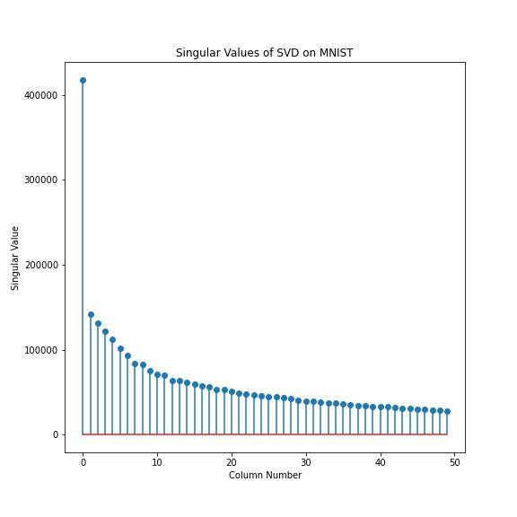
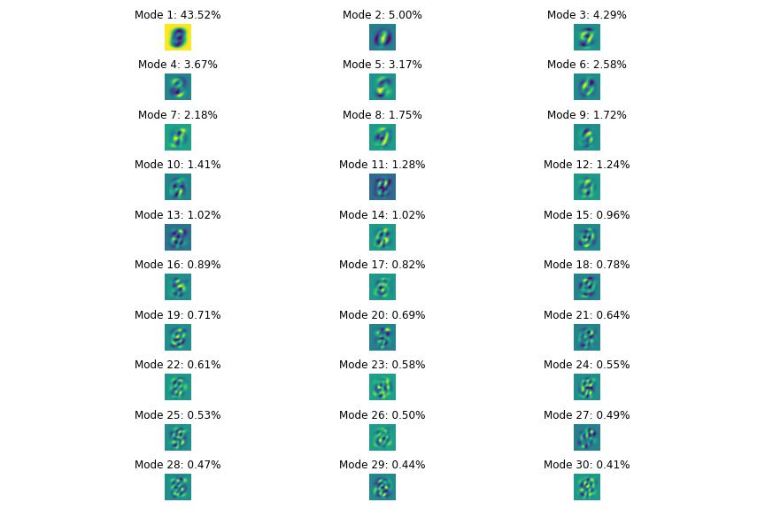

# Homework 3 Report - Comparing Linear Classifiers on MNIST Data Set

**Author**:

Ewan Lister

**Abstract**:

In this assignment, we conduct an analysis of the MNIST dataset, a collection of handwritten digits used for machine learning research. The analysis begins with an SVD analysis of the digit images, exploring the singular value spectrum and determining the rank necessary for good image reconstruction. The interpretation of the U, $\Sigma$, and V matrices is also discussed. The report then builds a classifier to identify individual digits in the training set, using LDA to classify two and three selected digits. The difficulty of separating different pairs of digits is quantified using LDA, SVM, and decision tree classifiers, with performance compared on both training and test sets. The report includes multiple visualizations to aid in understanding the results.

## Introduction and Overview

In this report, we present an analysis of the MNIST dataset, which contains handwritten digits that have been used extensively for machine learning research. We begin by discussing the theoretical background, including the concepts of SVD analysis, PCA space, and linear classifiers such as LDA and SVM. We then describe the algorithm implementation and development process, including reshaping the digit images into column vectors, performing SVD analysis, and building classifiers to identify individual digits.

Next, we present the computational results of our analysis, including the singular value spectrum and the number of modes necessary for good image reconstruction. We also discuss the accuracy of our classifiers on the training and test sets, as well as the difficulty of separating different pairs of digits. We compare the performance of LDA, SVM, and decision tree classifiers on the hardest and easiest pairs of digits to separate.

Finally, we provide a summary and conclusions, discussing the key findings of our analysis and the implications for future research. Throughout the report, we include visualizations to aid in understanding the results. Overall, our analysis demonstrates the power of SVD analysis and linear classifiers for identifying handwritten digits and highlights the challenges involved in separating certain pairs of digits.

## Theoretical Background

In this section we will present mathematical theory covering the topics of correlation, eigenpairs, and singular value decomposition. Knowing the basic principles of these techniques will help us to investigate the facial image data.

## Support Vector Machines (SVM)

Support Vector Machines (SVM) are a popular class of binary classifiers used in machine learning. The goal of SVM is to find a hyperplane that maximally separates two classes of data points. This hyperplane is chosen to maximize the margin between the two classes of points.

The SVM optimization problem can be written as follows:

$$min_{w,b,\\xi} \\frac{1}{2} \\lVert w \\rVert^2 + C\\sum_{i=1}^{n} \\xi_i$$

subject to the constraints:

$$y_i(w^Tx_i+b) \\geq 1 - \\xi_i$$

$\\xi_i \\geq 0$

where $w$ is the weight vector, $b$ is the bias term, $\xi_i$ is the slack variable, and $C$ is a hyperparameter that controls the trade-off between maximizing the margin and minimizing the classification error. The first constraint ensures that each data point is on the correct side of the hyperplane, while the second constraint ensures that the margin is not too wide.

## Linear Discriminant Analysis (LDA)
Linear Discriminant Analysis (LDA) is a popular method for dimensionality reduction and classification. The goal of LDA is to find a linear transformation of the data that maximizes the separation between two classes.

The LDA optimization problem can be written as follows:

max
⁡
�
�
�
�
�
�
�
�
�
�
�
max 
w
​
  
w 
T
 S 
w
​
 w
w 
T
 S 
b
​
 w
​
 

where $S_b$ is the between-class scatter matrix and $S_w$ is the within-class scatter matrix. The between-class scatter matrix measures the distance between the class means, while the within-class scatter matrix measures the variability within each class.

The optimal weight vector $w$ is then used to project the data onto a lower-dimensional subspace, which can be used for classification.

Decision Trees
Decision trees are a popular class of classifiers that use a tree structure to recursively partition the feature space. The goal of a decision tree is to find the optimal set of binary splits that minimize the classification error.

The decision tree optimization problem can be written as follows:

min
⁡
Θ
∑
�
=
1
�
�
(
�
�
≠
�
(
�
�
;
Θ
)
)
min 
Θ
​
 ∑ 
i=1
n
​
 I(y 
i
​
 

=f(x 
i
​
 ;Θ))

where $\Theta$ is the set of binary splits, $f(x_i; \Theta)$ is the decision tree classifier, and $I(y_i \neq f(x_i; \Theta))$ is the classification error. The optimal set of binary splits can be found using various algorithms, such as greedy search or dynamic programming.

Overall, SVM, LDA, and decision trees are all popular and effective methods for classification in machine learning. Each method has its own strengths and weaknesses, and the choice of method often depends on the specific problem and the characteristics of the data.

## Algorithm Implementation and Development

import statements and loading data

    # import numpy, scipy, and yale faces data
    import numpy as np
    from scipy.io import loadmat
    import matplotlib.pyplot as plt
    results=loadmat('yalefaces.mat')
    X=results['X'] 

### (a) Compute a 100 × 100 correlation matrix $C$ where you will compute the dot product (correlation) between the first 100 images in the matrix $X$.

isolate first 100 vectors in matrix and compute dot product

    first_100_images = X[:, :100]

    correlation_matrix = np.dot(first_100_images.T, first_100_images)

plot correlation matrix

    # Plot the correlation matrix
plt.figure(figsize=(10, 10))
plt.imshow(correlation_matrix, cmap='viridis')
plt.colorbar()

    # Set the title and axes labels
    plt.title('Correlation Matrix of the First 100 Images')
    plt.xlabel('Image Index')
    plt.ylabel('Image Index')

    # Adjust the axes range and ticks
    plt.xlim(-0.5, 99.5)
    plt.ylim(99.5, -0.5)
    plt.xticks(np.arange(0, 100, 10))
    plt.yticks(np.arange(0, 100, 10))

    # Show the plot
    plt.show()

### (b) From the correlation matrix for part (a), which two images are most highly correlated? Which are most uncorrelated? Plot these faces.

mask matrix data so that identical but low correlation value images are not used

    masked_corr_matrix = np.ma.array(correlation_matrix, mask=np.eye(correlation_matrix.shape[0], dtype=bool))

identify min and max correlation images and extract

    max_corr_indices = np.unravel_index(np.ma.argmax(masked_corr_matrix), masked_corr_matrix.shape)
    min_corr_indices = np.unravel_index(np.ma.argmin(masked_corr_matrix), masked_corr_matrix.shape)

    highest_corr_images = first_100_images[:, max_corr_indices]
    lowest_corr_images = first_100_images[:, min_corr_indices]

plot images 

    fig, axs = plt.subplots(2, 2, figsize=(10, 10))

    # Plot the images with highest correlation
    axs[0, 0].imshow(highest_corr_images[:, 0].reshape(32, 32), cmap='viridis')
    axs[0, 0].set_title('Image {} (High Correlation)'.format(max_corr_indices[0]))
    axs[0, 0].axis('off')

    axs[0, 1].imshow(highest_corr_images[:, 1].reshape(32, 32), cmap='viridis')
    axs[0, 1].set_title('Image {} (High Correlation)'.format(max_corr_indices[1]))
    axs[0, 1].axis('off')

    # Plot the images with lowest correlation
    axs[1, 0].imshow(lowest_corr_images[:, 0].reshape(32, 32), cmap='viridis')
    axs[1, 0].set_title('Image {} (Low Correlation)'.format(min_corr_indices[0]))
    axs[1, 0].axis('off')

    axs[1, 1].imshow(lowest_corr_images[:, 1].reshape(32, 32), cmap='viridis')
    axs[1, 1].set_title('Image {} (Low Correlation)'.format(min_corr_indices[1]))
    axs[1, 1].axis('off')

    plt.tight_layout()
    plt.show()

### (c) Repeat part (a) but now compute the 10 × 10 correlation matrix between images and plot the correlation matrix between them.

    images = [1, 313, 512, 5, 2400, 113, 1024, 87, 314, 2005]

isolate images and calculate correlation matrix, account for 1 based indexing

    image_indices = [1, 313, 512, 5, 2400, 113, 1024, 87, 314, 2005]
    selected_images = X[:, [i - 1 for i in image_indices]]

    correlation_matrix = np.dot(selected_images.T, selected_images)

plot correlation matrix

    plt.figure(figsize=(8, 8))
    plt.imshow(correlation_matrix, cmap='viridis')
    plt.colorbar()

    plt.title('Correlation Matrix of Selected Images')
    plt.xlabel('Image Index')
    plt.ylabel('Image Index')

    plt.xticks(np.arange(0, 10), image_indices)
    plt.yticks(np.arange(0, 10), image_indices)

    plt.show()

### (d) Create the matrix $Y = XX^{T}$ and find the first six eigenvectors with the largest magnitude eigenvalue.

create symmetric matrix, similar to correlation matrix of all images, and compute eigenpairs
    
    Y = np.dot(X,np.transpose(X))

    eigenvalues, eigenvectors = np.linalg.eigh(Y)

sort eigenvalues and vectors by eigenvalue magnitude, select first 6 eigen vectors in sorted list
    
    sorted_indices = np.argsort(eigenvalues)[::-1]
    sorted_eigenvalues = eigenvalues[sorted_indices]
    sorted_eigenvectors = eigenvectors[:, sorted_indices]

    first_6_eigenvectors = sorted_eigenvectors[:, :6]

plot and print first 6 eigenvectors

    print(first_6_eigenvectors)
    fig, axs = plt.subplots(2, 3, figsize=(12, 8))
    for i in range(6):
        row = i // 3
        col = i % 3
        axs[row, col].imshow(first_6_eigenvectors[:, i].reshape(32, 32), cmap='viridis')
        axs[row, col].set_title('Eigenvector {}'.format(i+1))
        axs[row, col].axis('off')

    plt.tight_layout()
    plt.show()

### (e) SVD the matrix X and find the first six principal component directions.

perform SVD using numpy function, and take first 6 principle component directions, print component directions

    U, S, Vt = np.linalg.svd(X, full_matrices=False)

    first_6_principal_components = Vt[:6, :]

    print(first_6_principal_components)

### (f) Compare the first eigenvector $v_{1}$ from (d) with the first SVD mode $u_{1}$ from (e) and compute the norm of difference of their absolute values.

compute absolute values and take norm difference

    abs_first_eigenvector = np.abs(sorted_eigenvectors[:, 0])
    abs_first_svd_mode = np.abs(U[:, 0])

    # Compute the norm difference of the absolute values
    norm_difference = np.linalg.norm(abs_first_eigenvector - abs_first_svd_mode)

plot and print
    print("Norm difference of the absolute values:", norm_difference)

    fig, axs = plt.subplots(1, 2, figsize=(12, 6))

    # Plot the first eigenvector
    axs[0].imshow(sorted_eigenvectors[:, 0].reshape(32, 32), cmap='viridis')
    axs[0].set_title('First Eigenvector')
    axs[0].axis('off')

    # Plot the first SVD mode from the U matrix
    axs[1].imshow(U[:, 0].reshape(32, 32), cmap='viridis')
    axs[1].set_title('First SVD Mode (U matrix)')
    axs[1].axis('off')

    plt.tight_layout()
    plt.show()

### (g) Compute the percentage of variance captured by each of the first 6 SVD modes. Plot the first 6 SVD modes.

compute total variance captured by all modes and divide individual variances captured by total variance
    
    total_variance_captured = np.sum(S ** 2)

    variance_captured = (S ** 2) / total_variance_captured

convert to percentage and print

    percentage_variance_captured = variance_captured * 100

    for i in range(6):
        print("Percentage of the variance captured by Mode {}: {:.2f}%".format(i+1, percentage_variance_captured[i]))

plot first 6 modes

    for i in range(6):
        row = i // 3
        col = i % 3
        axs[row, col].imshow(U[:, i].reshape(32, 32), cmap='viridis')
        axs[row, col].set_title('Mode {}: {:.2f}%'.format(i+1, percentage_variance_captured[i]))
        axs[row, col].axis('off')

    plt.tight_layout()
    plt.show()

## Computational Results

### Problem (a) 100 x 100 correlation matrix

### Problem (b) Most and least correlated images

### Problem (c) 10 x 10 correlation matrix

### Problem (d) First 6 eigenvectors of matrix $Y$

### (f) Principal eigenvector and first mode comparison

    Norm difference of the absolute values: 5.688808695715053e-16

### (g) First 6 modes and respective percentage of variance captured

## Summary and Conclusions

Applying the mathematical techniques of correlation, eigenfactorization, and SVD has allowed us to generate some interesting results from `yalefaces.mat`. In problem (a) we were able to identify two images that are likely to contain the same face simply based on the high correlation between the two, additionally we were able to find faces which are either unrelated, or simply have extremely varied lighting conditions based on their low correlation.

Isolating the eigenvectors of `yalefaces.mat` in problem (d) revealed a series of images that resemble primitive faces, becoming less and less endearing as the scaling value of the eigenvector decreases. Interestingly, some faces appear to resemble even functions, while others are odd. 

When comparing the highest eigenvalue eigenvector with the first mode of the SVD in problem (f), another interesting result arises in that the two images are nearly identical, having a miniscule norm difference. In fact, all 6 modes appear very similar, except that some have their sign flipped. This is explainable based on the fact that in SVD we only allow $\Sigma$ to contain positive singular values. This similarity leads one to conclude that the modes of the U matrix in SVD are similar to eigen values in a matrix. Except that they exist for all matrices.

As a general note, another special quality of the eigenpairs and SVD technique was that they allowed us to reduce the dimensionality of the data set, while still preserving most of the variance associated with the original data set. With only 6 SVD modes, we can reconstruct the individual features of each image within 93.89% of the original, which for all intents and purposes, makes these techniques robust for compression.

By applying mathematical techniques that allow for fast comparison and reduction in dimensionality of the data. We can store, understand, and utilize the data much faster, and much more clearly than without.
