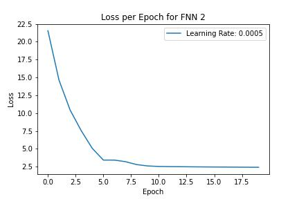

# Homework 4 Report - Comparing Neural Networks with Traditional ML Classifiers

**Author**:

Ewan Lister

**Abstract**:

This report explores the construction of feedforward neural networks, or **FFNNs**, and how they compare to other canonical machine learning techniques. In the first part of the analysis, a three-layer feed-forward neural network is constructed and fitted to a dataset of 31 data points. The network is trained on different samples of the 31 points, and tested on the remainder. The least square errors of the network on the training and test data are computed and compared to the models fit in homework one. In the second part of the analysis, a feed-forward neural network is trained on a PCA compression of the MNIST dataset. The results of the neural network were compared against those of LSTM, SVM, and decision tree classifiers. The report includes code snippets, visualizations, and interpretations of the results.

## Introduction and Overview

Neural networks have become one of the most widely used and effective methods in data science for solving various machine learning problems, such as classification, regression, and image recognition. Neural networks are inspired by the functioning of the human brain and consist of multiple layers of interconnected neurons that can learn and extract complex patterns and relationships from data. The popularity of neural networks is due to their ability to automatically learn complex features from raw data, handle large amounts of data, and generalize well to unseen data.

In this report, we compare the performance of a feed-forward neural network with that of other popular machine learning models, such as LSTM, SVM, and decision tree classifiers. LSTM is a type of recurrent neural network that is particularly useful for handling sequential data, such as time series or natural language processing. SVM is a popular method for binary classification that tries to find the optimal decision boundary that maximally separates the two classes. Decision trees are another type of machine learning model that can be used for both classification and regression tasks and are particularly useful for generating interpretable models.

We will begin by covering the theoretical background of NNs, and LSTM, wish a short refresher on SVM and decision tree classifiers. This will follow with an implementation of these models into python, interpreting the results of training the models, followed by a summary and conclusion.

## Theoretical Background

### Neural Networks

A three-layer feedforward neural network consists of an input layer, a hidden layer, and an output layer. Each layer is composed of multiple neurons, also known as nodes, that receive inputs, perform computations, and generate outputs. The input layer receives the input data, and the output layer generates the final output of the network. The hidden layer(s) perform intermediate computations and extract relevant features from the input data.

Let $x$ be the input data, $y$ be the desired output, $W$ and $b$ be the weights and biases of the neurons, and $\sigma$ be the activation function of the neurons. The computation performed by a three-layer feedforward neural network can be expressed mathematically as follows:

$$h_1 = \sigma(W_1 x + b_1)$$

$$h_2 = \sigma(W_2 h_1 + b_2)$$

$$\hat{y} = \sigma(W_3 h_2 + b_3)$$

where $h_1$ and $h_2$ are the hidden layer outputs, and $\hat{y}$ is the predicted output of the network. $W_1$, $W_2$, and $W_3$ are the weight matrices between the layers, and $b_1$, $b_2$, and $b_3$ are the bias vectors of the neurons. The activation function $\sigma$ is typically a non-linear function that introduces non-linearity into the network and allows it to learn complex relationships between the input and output data. Some common activation functions include the sigmoid function, the ReLU function, and the hyperbolic tangent function.

In practice, the weights and biases of the network are learned through a process called backpropagation, where the network is trained on a set of training data to minimize the difference between the predicted outputs and the desired outputs. This process involves computing the gradient of the loss function with respect to the weights and biases, and updating them using an optimization algorithm such as stochastic gradient descent (SGD).

## Long Short-Term Memory (LSTM) Networks

Long Short-Term Memory (LSTM) networks are a type of recurrent neural network (RNN) that are designed to avoid the long-term dependency problem. This is achieved through their unique cell state structure which allows them to maintain and access information over long sequences, making them particularly effective for tasks involving sequential data such as time series analysis, natural language processing, and more.

The core idea behind LSTMs is the cell state, which runs straight down the entire chain, with only minor linear interactions. It's the LSTM's ability to regulate the cell state's information that makes it so special. At each step in the sequence, there are structures called gates that regulate the information flow into and out of the cell state. These gates are a way to optionally let information through, and they are composed out of a sigmoid neural net layer and a pointwise multiplication operation. The sigmoid layer outputs numbers between zero and one, describing how much of each component should be let through. A value of zero means "let nothing through," while a value of one means "let everything through!" An LSTM has three of these gates: the forget gate, the input gate, and the output gate. These are defined mathematically as follows:

$$f_t = \sigma(W_f \cdot [h_{t-1}, x_t] + b_f)$$

$$i_t = \sigma(W_i \cdot [h_{t-1}, x_t] + b_i)$$

$$o_t = \sigma(W_o \cdot [h_{t-1}, x_t] + b_o)$$

where $f_t$, $i_t$, and $o_t$ are the forget, input, and output gates at time $t$, respectively, $\sigma$ is the sigmoid function, $W$ and $b$ are the weight and bias parameters, $h_{t-1}$ is the hidden state from the previous time step, and $x_t$ is the input at the current time step. The forget gate determines how much of the past information (i.e., the cell state) to retain, the input gate decides how much of the current information to store in the cell state, and the output gate determines how much of the information in the cell state to reveal to the next layers in the network.

## Algorithm Implementation and Development

import in relevant libraries, we need all of the classifier models from canonical ML, as well as torch

    import torch
    import torch.nn as nn
    import torchvision.datasets as datasets
    import torchvision.transforms as transforms
    import scipy.io as sio
    import numpy as np
    import matplotlib.pyplot as plt
    from sklearn.linear_model import Lasso
    from sklearn.decomposition import PCA
    from scipy.io import loadmat
    from sklearn.datasets import fetch_openml
    from sklearn.model_selection import train_test_split
    import torch.optim as optim
    from sklearn.metrics import accuracy_score
    from sklearn.svm import SVC

initialize X and Y data in tensor form

    X = torch.arange(0, 31, dtype=torch.float32).reshape(-1, 1)
    Y = torch.tensor([30, 35, 33, 32, 34, 37, 39, 38, 36, 36, 37, 39, 42, 45, 45, 41,
                    40, 39, 42, 44, 47, 49, 50, 49, 46, 48, 50, 53, 55, 54, 53],
                    dtype=torch.float32).reshape(-1, 1)

    data = dict(zip(X, Y))

### (i) Fit the data to a three layer feed forward neural network.

define the neural network architecture

    class ThreeLayerNet(nn.Module):
        def __init__(self):
            super().__init__()
            self.fc1 = nn.Linear(1, 20)  # input layer -> hidden layer
            self.fc2 = nn.Linear(20, 10) # hidden layer -> hidden layer
            self.fc3 = nn.Linear(10, 1)  # hidden layer -> output layer
            
        def forward(self, x):
            x = torch.relu(self.fc1(x))
            x = torch.relu(self.fc2(x))
            x = self.fc3(x)
            return x

initialize learning rate, network, optimizer, and loss criterion

    lr = 0.0001
    net = ThreeLayerNet()
    optimizer = torch.optim.SGD(net.parameters(), lr=0.01)
    criterion = nn.MSELoss()

train the neural network using gradient descent, no batching, and print loss after all pairs have been
back propogated

    num_epochs = 15
    for epoch in range(num_epochs):
        for i, (x) in enumerate(X):
            optimizer.zero_grad()
            outputs = net(x)
            loss = criterion(outputs, Y[i])
            loss.backward()
            optimizer.step()
            
            if (i + 1) % 31 == 0:
                print ('Epoch [{}/{}], Step [{}/{}], Loss: {:.4f}'.format(epoch+1, num_epochs, i+1, 31, loss.item()))

### (ii) Using the first 20 data points as training data, fit the neural network. Compute the least-square error for each of these over the training points. Then compute the least square error of these models on the test data which are the remaining 10 data points.

define a function which can be used to check error quickly on training and test data

    def check_train_test_error(x_train, y_train, x_test, y_test):
        for i, (x) in enumerate(x_train):
            outputs = net(x)
            error = criterion(outputs, y_train[i])
            print('Train error for x = {}, y = {} : {:.4f}'.format(x, y_train[i], error))
        print('\n')
        for i, (x) in enumerate(x_test):
            outputs = net(x)
            error = criterion(outputs, y_test[i])
            print('Test error for x = {}, y = {} : {:.4f}'.format(x, y_test[i], error))

isolate first 20 data points

    x_train = X[0:20]
    y_train = Y[0:20]
    x_test = X[20:31]
    y_test = Y[20:31]

train network on first 20 data points, examine progress of SGD via print statements

    num_epochs = 15
    for epoch in range(num_epochs):
        for i, (x) in enumerate(x_train):
            optimizer.zero_grad()
            outputs = net(x)
            loss = criterion(outputs, y_train[i])
            loss.backward()
            optimizer.step()
            
            if (i + 1) % 20 == 0:
                print ('Epoch [{}/{}], Step [{}/{}], Loss: {:.4f}'.format(epoch+1, num_epochs, i+1, 20, loss.item()))

check error on training and test data

    check_train_test_error(x_train, y_train, x_test, y_test)

### (iii) Repeat (iii) but use the first 10 and last 10 data points as training data. Then fit the model to the test data (which are the 10 held out middle data points). Compare these results to (iii)

isolate first and last 10 training points

    x_train = torch.cat([X[0:10], X[20:31]])
    y_train = torch.cat([Y[0:10], Y[20:31]])
    x_test = X[10:20]
    y_test = Y[10:20]

set optimizer

    optimizer = torch.optim.SGD(net.parameters(), lr=0.01)

train network on first and last 10 data points, examine progress of SGD via print statements

    num_epochs = 50
    for epoch in range(num_epochs):
        for i, (x) in enumerate(x_train):
            optimizer.zero_grad()
            outputs = net(x)
            loss = criterion(outputs, y_train[i])
            loss.backward()
            optimizer.step()
            
            if (i + 1) % 20 == 0:
                print ('Epoch [{}/{}], Step [{}/{}], Loss: {:.4f}'.format(epoch+1, num_epochs, i+1, 20, loss.item()))

check error on training data and middle 10 points

    check_train_test_error(x_train, y_train, x_test, y_test)

### (iv) Compare the models fit in homework one to the neural networks in (ii) and (iii)

Similarly to the curve fitting in homework 1, the neural network does a poor job of making any extrapolations about its test data if the data is outside of the domain of the training data. For example, the network did well when test data contained the 10 points between point 9 and point 20, but poorly when the test data was that from 20 to 31, which is unbounded by any training data. Thus is performs very similarly to the curve fitting in homework 1. However, the loss, for each value is still much greater in the case of the neural network.

## II Now train a feedforward neural network on the MNIST data set. You will start by performing the following analysis:

### (i) Compute the first 20 PCA modes of the digit images.

fetch MNIST dataset, convert data and labels into numpy arrays

    mnist = fetch_openml('mnist_784', version=1)
    data = np.array(mnist['data'])
    labels = np.array(mnist['target'])

apply PCA transformation onto the first 20 modes

    pca = PCA(n_components=20)
    data_pca_1 = pca.fit_transform(data)

### (ii) Build a feed-forward neural network to classify the digits. Compare the results of the neural network against LSTM, SVM (support vector machines) and decision tree classifiers.

separate training and test data for use in LSTM, SVM, and DTC classifiers. convert labels to ints

    data_train, data_test, label_train, label_test = train_test_split(data_pca_1, labels, test_size=0.3, random_state=42)
    label_train = label_train.astype(np.int16)
    label_test = label_test.astype(np.int16)

### testing neural network on MNIST data

define batch size, learning rate, and epoch number as the hyperparameters

    batch_size = 128
    learning_rate = 0.001
    num_epochs = 10

define the model architecture

    class FeedforwardNN(nn.Module):
        def __init__(self):
            super(FeedforwardNN, self).__init__()
            self.fc1 = nn.Linear(784, 256)
            self.fc2 = nn.Linear(256, 128)
            self.fc3 = nn.Linear(128, 10)
            
        def forward(self, x):
            x = x.view(-1, 784)
            x = torch.relu(self.fc1(x))
            x = torch.relu(self.fc2(x))
            x = self.fc3(x)
            return x

initialize the model and optimizer

    model = FeedforwardNN()
    optimizer = optim.Adam(model.parameters(), lr=learning_rate)

train the model

    for epoch in range(num_epochs):
        for batch_idx, (data, target) in enumerate(train_loader):
            optimizer.zero_grad()
            output = model(data)
            loss = nn.CrossEntropyLoss()(output, target)
            loss.backward()
            optimizer.step()
            
            if batch_idx % 100 == 0:
                print('Epoch {} [{}/{} ({:.0f}%)]\tLoss: {:.6f}'.format(
                    epoch, batch_idx * len(data), len(train_loader.dataset),
                    100. * batch_idx / len(train_loader), loss.item()))

evaluate the model on the test set

    test_loss = 0
    correct = 0
    with torch.no_grad():
        for data, target in test_loader:
            output = model(data)
            test_loss += nn.CrossEntropyLoss()(output, target).item()
            pred = output.argmax(dim=1, keepdim=True)
            correct += pred.eq(target.view_as(pred)).sum().item()

    test_loss /= len(test_loader.dataset)
    accuracy = 100. * correct / len(test_loader.dataset)
    print('Test set: Average loss: {:.4f}, Accuracy: {}/{} ({:.0f}%)'.format(
        test_loss, correct, len(test_loader.dataset), accuracy))

### testing LSTM on MNIST data

define the hyperparameters

    batch_size = 128
    learning_rate = 0.001
    num_epochs = 10
    hidden_size = 128
    num_layers = 2

define the LSTM architecture

    class LSTM(nn.Module):
        def __init__(self):
            super(LSTM, self).__init__()
            self.lstm = nn.LSTM(input_size=28, hidden_size=hidden_size, num_layers=num_layers, batch_first=True)
            self.fc = nn.Linear(hidden_size, 10)
            
        def forward(self, x):
            h0 = torch.zeros(num_layers, x.size(0), hidden_size).to(x.device)
            c0 = torch.zeros(num_layers, x.size(0), hidden_size).to(x.device)
            out, (h_n, c_n) = self.lstm(x, (h0, c0))
            out = self.fc(h_n[-1])
            return out

initialize the model and optimizer

    model = LSTM()
    optimizer = optim.Adam(model.parameters(), lr=learning_rate)

train the model

    for epoch in range(num_epochs):
        for batch_idx, (data, target) in enumerate(train_loader):
            optimizer.zero_grad()
            data = data.view(batch_size, 28, 28)
            output = model(data)
            loss = nn.CrossEntropyLoss()(output, target)
            loss.backward()
            optimizer.step()
            
            if batch_idx % 100 == 0:
                print('Epoch {} [{}/{} ({:.0f}%)]\tLoss: {:.6f}'.format(
                    epoch, batch_idx * len(data), len(train_loader.dataset),
                    100. * batch_idx / len(train_loader), loss.item()))

evaluate the model on the test set

    test_loss = 0
    correct = 0
    with torch.no_grad():
        for data, target in test_loader:
            data = data.view(data.shape[0], 28, 28)
            output = model(data)
            test_loss += nn.CrossEntropyLoss()(output, target).item()
            pred = output.argmax(dim=1, keepdim=True)
            correct += pred.eq(target.view_as(pred)).sum().item()

    test_loss /= len(test_loader.dataset)
    accuracy = 100. * correct / len(test_loader.dataset)
    print('Test set: Average loss: {:.4f}, Accuracy: {}/{} ({:.0f}%)'.format(
        test_loss, correct, len(test_loader.dataset), accuracy))

### fitting an SVM classifier

    from sklearn.metrics import accuracy_score
    from sklearn.svm import SVC
    # Train a linear classifier
    clf = SVC()
    clf.fit(data_train, label_train)

    # Evaluate the performance on the test set
    y_pred = clf.predict(data_test)
    acc = accuracy_score(label_test, y_pred)
    print(f"Accuracy for SVM: {acc:.2f}")

### fitting a DTC classifier

    from sklearn.tree import DecisionTreeClassifier

    # Train a DTC classifier
    clf = DecisionTreeClassifier()
    clf.fit(data_train, label_train)

    # Evaluate the performance on the test set
    y_pred = clf.predict(data_test)
    acc = accuracy_score(label_test, y_pred)
    print(f"Accuracy for DTC: {acc:.2f}")

## Computational Results and Interpretation

### **Part 1**

### Training a 3 Layer FFNN on all 30 points

### Training a 3 Layer FFNN on first 20 points

### Training a 3 Layer FFNN on First and Last 10 points

### Comparing models to HW1 performance

### **Part 2**

### Build a FFNN for classifying MNIST Data

### Comparison with LSTM, SVM, and DTC

## Summary and Conclusions

In conclusion, the analysis of the MNIST dataset using SVD, LDA, SVM, and decision tree classifiers provided valuable insights into the classification and separation of handwritten digits. The singular value spectrum analysis revealed the rank of the digit space, and the interpretation of the U, Σ, and V matrices further clarified the relationships between the digit images. The 3D projection onto selected V-modes offered a visual representation of the data in PCA space, which facilitated the development of linear classifiers for digit identification.

The classification performance varied depending on the chosen digits and classification techniques. Notably, digits 6 and 7 were the easiest to separate, while digits 9 and 7 presented the greatest challenge. Among the classifiers tested, the SVM classifier demonstrated the best overall performance in separating all ten digits, outperforming both LDA and decision tree classifiers, particularly for the hardest and easiest pairs of digits to separate.

The results underscore the importance of selecting appropriate classification techniques for specific tasks and highlight the effectiveness of SVM classifiers for this particular dataset. Additionally, the report emphasized the importance of visualizations and comparisons between training and test sets to ensure reliable and generalizable conclusions. Future work could explore other classification algorithms and feature extraction methods to further improve the performance of digit classification and recognition tasks.